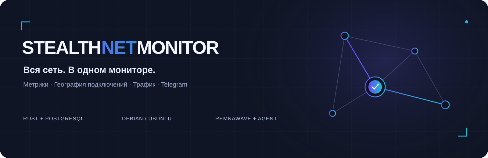
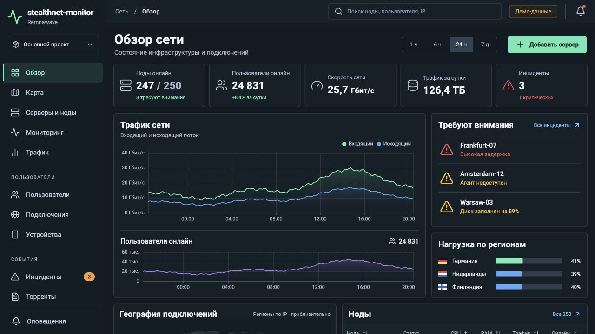
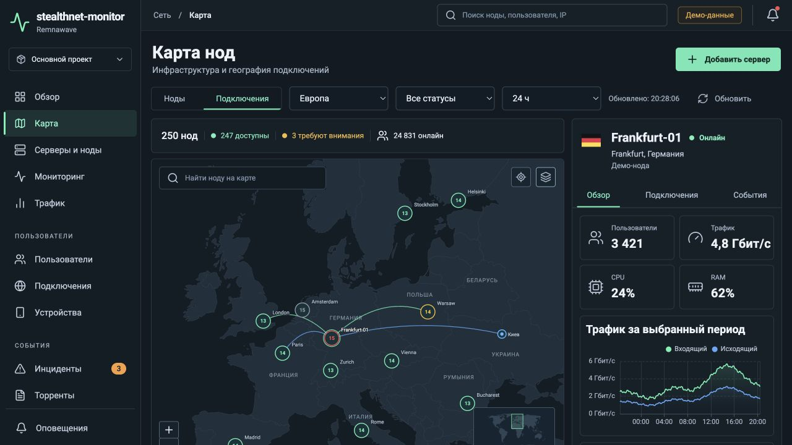
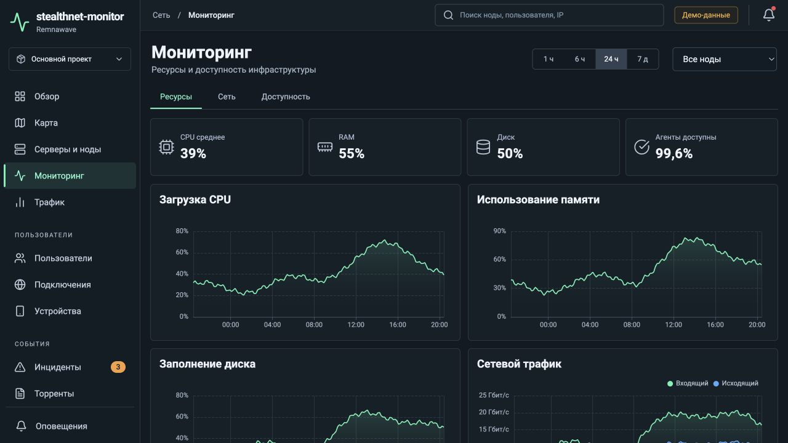
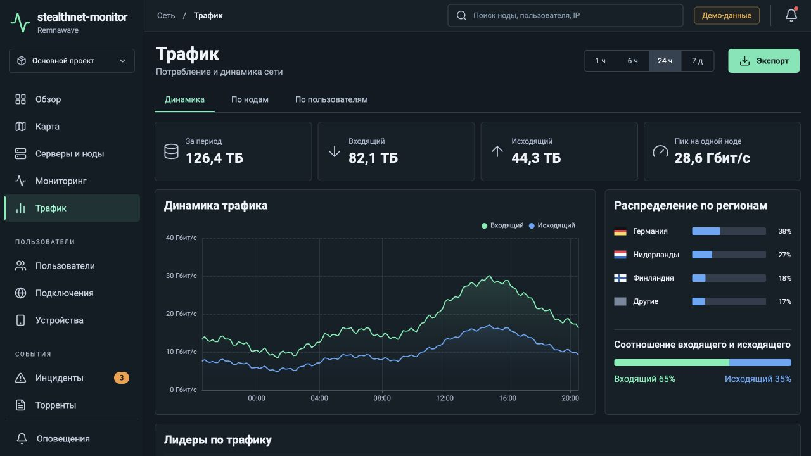
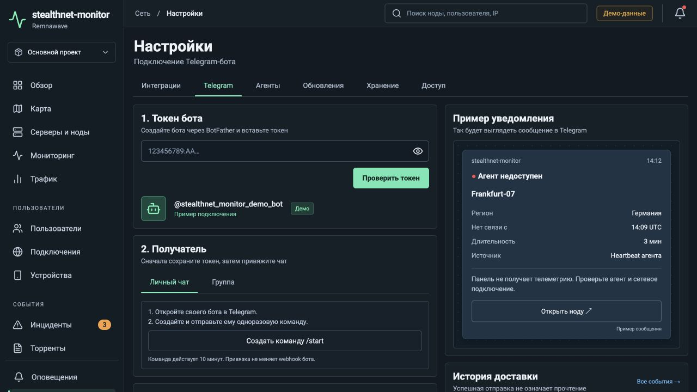
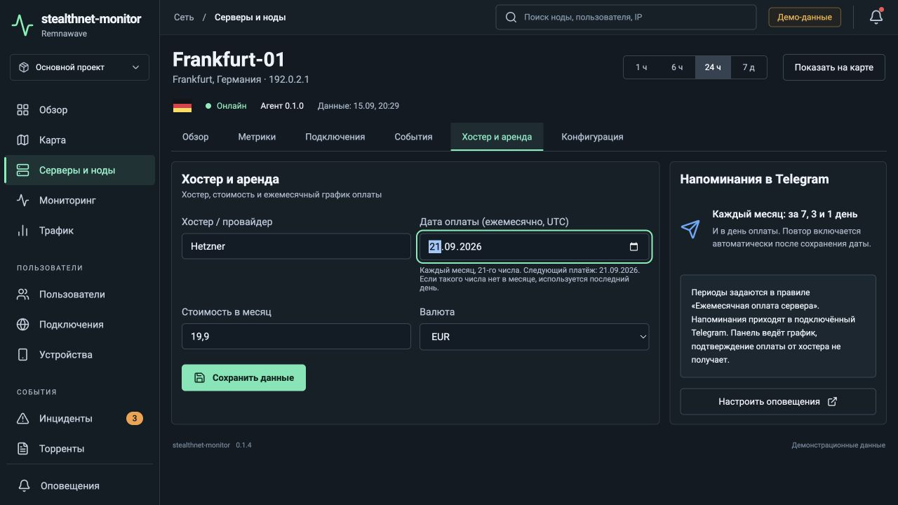

<p align="center">
  <a href="docs/GUIDE.md#установка"></a>
  <a href="docs/GUIDE.md"></a>
  <a href="https://t.me/stealthnet_admin_panel"></a>
  <a href="https://github.com/STEALTHNET-APP/stealthnet-monitor/releases/latest"></a>
</p>

**stealthnet-monitor** — панель мониторинга серверов и нод Remnawave: ресурсы, трафик, география подключений, устройства и уведомления в Telegram. Устанавливается на ваш сервер; агент собирает данные на каждой ноде.

**v0.1.5 · поиск по полной базе, история онлайна, полный импорт HWID и ежемесячные платежи.**

<p align="center">
  <a href="https://github.com/STEALTHNET-APP/stealthnet-monitor/actions/workflows/ci.yml"></a>
  <a href="LICENSE"></a>
  
  
</p>

## Вся инфраструктура перед глазами

| Серверы и ноды | Подключения и устройства | События и оплата |
|---|---|---|
| CPU, RAM, диск, скорость сети и состояние агента | Пользователи Remnawave и полный импорт HWID | Telegram: доступность, нагрузка и BitTorrent |
| Карта нод и приблизительная география IP | Поиск, профили, TCP-счётчики и наблюдаемая длительность | Хостер, стоимость и ежемесячная дата платежа |
| Графики с подсказками и историей измерений | Устройства и подключения связаны через аккаунт | Обновления из GitHub, резервная копия и откат |

## Галерея интерфейсов

Настоящий интерфейс в режиме **«Демо-данные»**. Нажмите на изображение, чтобы открыть его в полном размере.

<table>
<tr>
<td width="50%" valign="top"><h3>Обзор сети</h3><a href="docs/media/overview.png"></a><p>Общее состояние, графики трафика и онлайн на нодах</p></td>
<td width="50%" valign="top"><h3>Карта подключений</h3><a href="docs/media/map.png"></a><p>Ноды, регионы IP и подключения к выбранному серверу</p></td>
</tr>
<tr>
<td width="50%" valign="top"><h3>Мониторинг ресурсов</h3><a href="docs/media/monitoring.png"></a><p>Нагрузка серверов и история измерений</p></td>
<td width="50%" valign="top"><h3>Аналитика трафика</h3><a href="docs/media/traffic.png"></a><p>Входящий и исходящий поток, итоги по собранным замерам</p></td>
</tr>
<tr>
<td width="50%" valign="top"><h3>Telegram-уведомления</h3><a href="docs/media/telegram.png"></a><p>Свой бот, личный чат или группа, очередь доставки</p></td>
<td width="50%" valign="top"><h3>Ежемесячная оплата</h3><a href="docs/media/billing.png"></a><p>Дата платежа и напоминания каждый месяц</p></td>
</tr>
</table>

Все данные на скриншотах синтетические. Масштаб демонстрации не является результатом нагрузочного теста. [О скриншотах →](docs/media/README.md)

## Установка одной командой

**Debian 12 / Ubuntu 24.04 · Linux x86_64 · домен с A-записью · свободные порты 80 и 443.** Для сборки рекомендуются 2 CPU и 4 ГБ RAM.

Замените `monitor.example.com` своим доменом и выполните на сервере:

```bash
curl -fsSL https://raw.githubusercontent.com/STEALTHNET-APP/stealthnet-monitor/main/scripts/install-panel.sh -o install-stealthnet.sh && sudo bash install-stealthnet.sh --repo STEALTHNET-APP/stealthnet-monitor --domain monitor.example.com
```

Установщик берёт последний опубликованный релиз, создаёт индивидуальные секреты, собирает контейнеры и запускает HTTPS. Пароль владельца сохраняется в `/opt/stealthnet-monitor/.env` как `ADMIN_PASSWORD`. На слабом сервере первая сборка может занять 15–20 минут.

**Добавление ноды:** нажмите «Добавить сервер», выберите существующую ноду или чистый сервер и выполните выданную команду. Версия образа Remnawave Node подставляется автоматически. Для полной картины подключите Remnawave API в настройках и установите агент на ноды.

[Пошаговая установка и требования →](docs/GUIDE.md#установка) · [Подключение агентов →](docs/GUIDE.md#добавление-ноды)

## Управление и обновления

```bash
cd /opt/stealthnet-monitor
make start       # Запустить панель
make stop        # Остановить
make status      # Состояние служб
make logs        # Логи
make backup      # Резервная копия
make update      # Обновить из GitHub Releases
make rollback    # Вернуть предыдущее приложение
```

Перед обновлением создаётся резервная копия. При неудачном запуске обновление возвращает предыдущий образ. PostgreSQL хранит данные в отдельном томе. **Откат приложения не откатывает базу.** [Обновления и восстановление →](DEPLOYMENT.md)

## Telegram и ежемесячные платежи

Подключите своего бота по токену, выберите личный чат или группу и нужные события. Уведомления отправляются при потере связи, превышении порогов CPU/RAM/диска/трафика и обнаружениях BitTorrent. Состояние доставки видно в панели.

Для сервера можно указать **хостера, стоимость и дату оплаты**. Напоминания приходят **за 7, 3, 1 день и в день платежа — каждый месяц**. Для 29–31-го числа в коротком месяце используется последний день; исходное число сохраняется для следующего месяца. Смена месяца не подтверждает оплату у хостера.

[Настройка уведомлений →](docs/GUIDE.md#хостер-аренда-и-уведомления)

## Источники и точность данных

Проект находится в тестовой стадии. Панель показывает измеренные данные и отмечает недоступные значения.

- **Remnawave API:** запросы чтения GET. Поддерживаются старые плоские и новые вложенные поля; доступность HWID зависит от версии источника. Интеграция не удаляет и не изменяет клиентов Remnawave.
- **Агент:** системные метрики и наблюдения Xray. TCP-трафик и длительность измеряются с момента начала наблюдения; прошлые измерения не восстанавливаются.
- **Устройства:** HWID из запросов подписки; связь с подключениями — через аккаунт, без заявления о точном устройстве каждого канала.
- **География:** локальные DB-IP City/ASN Lite. IP клиентов не отправляются внешнему API. Тип оператора может быть предположительным; отличить домашний Wi-Fi от Ethernet по серверному IP нельзя.
- **BitTorrent:** срабатывания существующего правила Xray при доступном sniffing. Обнаружение всех зашифрованных потоков не гарантируется; конфигурация боевого VPN автоматически не меняется.
- **Масштаб:** поиск использует полную базу; карта — выборку последних 1000 наблюдений. Нагрузка сотен реальных агентов пока не проверялась.

[Источники, совместимость и ограничения →](docs/GUIDE.md#ограничения-первой-версии)

## Документация и сообщество

| Раздел | Что внутри |
|---|---|
| [Руководство](docs/GUIDE.md) | Установка, ноды, Telegram, данные и разработка |
| [Развёртывание](DEPLOYMENT.md) | Проверки, резервные копии, обновление и восстановление |
| [Архитектура](ARCHITECTURE.md) | Панель, агент, хранение и границы компонентов |
| [Дизайн](DESIGN.md) | Экраны и структура интерфейса |
| [Зависимости](THIRD_PARTY.md) | Компоненты, карты и лицензии |
| [Релизы](https://github.com/STEALTHNET-APP/stealthnet-monitor/releases) | Версии и изменения |

<p align="center"><a href="https://t.me/stealthnet_admin_panel"></a></p>

Часть экосистемы [STEALTHNET](https://github.com/STEALTHNET-APP). Лицензия [MIT](LICENSE).
